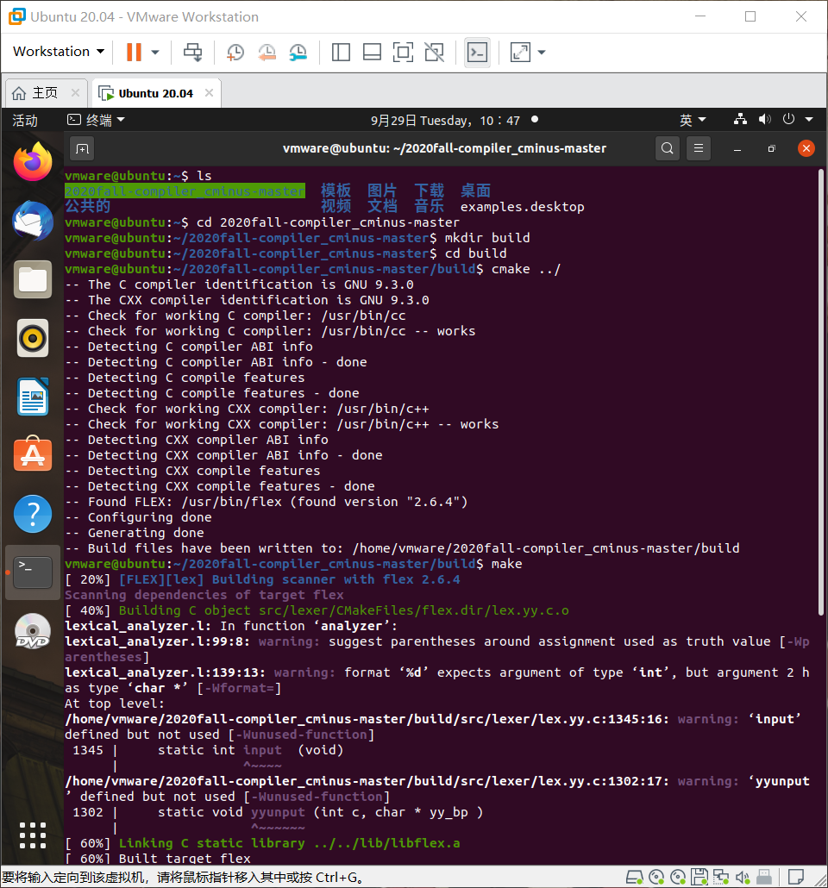
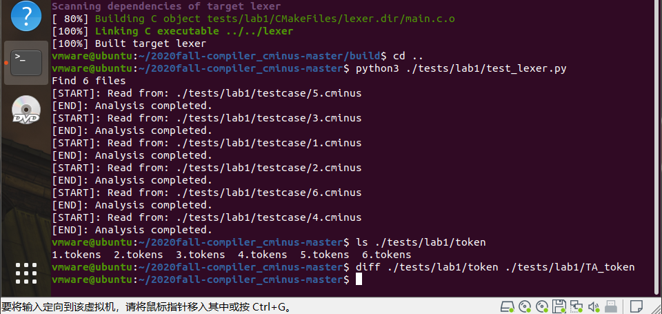

# lab1实验报告
学号：PB18111699 姓名:魏钊
## 实验要求
本次实验需要根据`cminux-f`的词法补全[lexical_analyer.l](./src/lexer/lexical_analyzer.l)文件，完成词法分析器，能够输出识别出的`token`，`type` ,`line(刚出现的行数)`，`pos_start(该行开始位置)`，`pos_end(结束的位置,不包含)`。如：

文本输入：

```c
 int a;
```

则识别结果应为：

```shell
int     280     1       2       5
a       284     1       6       7
;       270     1       7       8
```
**具体的需识别token参考[lexical_analyzer.h](./include/lexical_analyzer.h)**

**特别说明对于部分token，我们只需要进行过滤，即只需被识别，但是不应该被输出到分析结果中。因为这些token对程序运行不起到任何作用。**
## 实验难点
**注释的正则表达式和注释对应的模式、动作。**


**注释的形式为/\*coment\*/ 。coment的内容可以是任意的（除过连续的“\*/”，因为这里表示注释结束了）。而注释可能换行，导致lines++，以及pos_end和pos_start的改变。对于空格和\t只需要扫描和改变pos,不需要做出其他动作。**
## 实验设计
**先做出一些声明方便后面使用**

**digit [0-9]**

**letter [a-zA-Z]**

**ID {letter}+**

**INTEGER  {digit}+**

**FLOAT  ({digit}+\.|{digit}*\.{digit}+)**

**commentPattern "/*"([^\*]|(\*)*[^\*/])*(\*)*"*/"**
*****
**匹配的模式和动作**

[+] {pos_start=pos_end;pos_end=pos_start+strlen(yytext); return ADD;}

\- {pos_start=pos_end;pos_end=pos_start+strlen(yytext); return SUB;}

\* {pos_start=pos_end;pos_end=pos_start+strlen(yytext); return MUL;}

\/ {pos_start=pos_end;pos_end=pos_start+strlen(yytext); return DIV;}

\< {pos_start=pos_end;pos_end=pos_start+strlen(yytext); return LT;}

\<= {pos_start=pos_end;pos_end=pos_start+strlen(yytext); return LTE;}

\> {pos_start=pos_end;pos_end=pos_start+strlen(yytext); return GT;}

\>= {pos_start=pos_end;pos_end=pos_start+strlen(yytext); return GTE;}

== {pos_start=pos_end;pos_end=pos_start+strlen(yytext); return EQ;}

!= {pos_start=pos_end;pos_end=pos_start+strlen(yytext); return NEQ;}

= {pos_start=pos_end;pos_end=pos_start+strlen(yytext); return ASSIN;}


; {pos_start=pos_end;pos_end=pos_start+strlen(yytext); return SEMICOLON;}

, {pos_start=pos_end;pos_end=pos_start+strlen(yytext); return COMMA;}

\( {pos_start=pos_end;pos_end=pos_start+strlen(yytext); return LPARENTHESE;}

\) {pos_start=pos_end;pos_end=pos_start+strlen(yytext); return RPARENTHESE;}

\[ {pos_start=pos_end;pos_end=pos_start+strlen(yytext); return LBRACKET;}

\] {pos_start=pos_end;pos_end=pos_start+strlen(yytext); return RBRACKET;}

\{ {pos_start=pos_end;pos_end=pos_start+strlen(yytext); return LBRACE;}

\} {pos_start=pos_end;pos_end=pos_start+strlen(yytext); return RBRACE;}


else {pos_start=pos_end;pos_end=pos_start+strlen(yytext); return ELSE;}

if {pos_start=pos_end;pos_end=pos_start+strlen(yytext); return IF;}

int {pos_start=pos_end;pos_end=pos_start+strlen(yytext); return INT;}

float {pos_start=pos_end;pos_end=pos_start+strlen(yytext); return FLOAT;}

return {pos_start=pos_end;pos_end=pos_start+strlen(yytext); return RETURN;}

void {pos_start=pos_end;pos_end=pos_start+strlen(yytext); return VOID;}

while {pos_start=pos_end;pos_end=pos_start+strlen(yytext); return WHILE;}


{ID} {pos_start=pos_end;pos_end=pos_start+strlen(yytext); return IDENTIFIER;

{INTEGER} {pos_start=pos_end;pos_end=pos_start+strlen(yytext); return INTEGER;}

{FLOAT} {pos_start=pos_end;pos_end=pos_start+strlen(yytext); return FLOATPOINT;}

\[\] {pos_start=pos_end;pos_end=pos_start+strlen(yytext); return ARRAY;}

[ \t] {pos_start=pos_end;pos_end=pos_start+strlen(yytext); return BLANK;}

[\n]  {lines++; pos_start=1; pos_end=1; return EOL;}

**{commentPattern} { return COMMENT;}**

**分析器对于token匹配BLANK和EOL直接break即可，对于comment需要特殊处理。**


**case COMMENT:** 

            strcpy(temp,yytext);
		for(i=0;temp[i]!='\0';i++)
			{
				if(temp[i]=='\n')
				{
					lines++;
					pos_end=1;							
					pos_start=1;
				}
				else
				{
					pos_end++;
				}				
			}
		break;
## 实验结果验证
**助教提供测试样例的测试结果**







## 实验反馈
**实验难度适中，但需要大量资料查阅。**