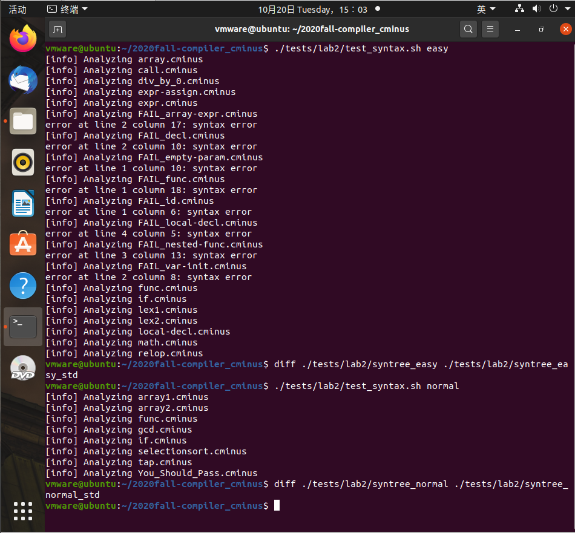

# lab2 实验报告
学号 PB18111699 姓名 魏钊
## 实验要求
本次实验需要各位同学首先将自己的 lab1 的词法部分复制到 `/src/parser` 目录的 [lexical\_analyzer.l](./src/parser/lexical\_analyzer.l)并合理修改相应部分，然后根据 `cminus-f` 的语法补全 [syntax\_analyer.y](./src/parser/syntax_analyzer.y) 文件，完成语法分析器，要求最终能够输出解析树。如：

输入：

```c
int bar;
float foo(void) { return 1.0; }
```

则 `parser` 将输出如下解析树：

```
>--+ program
|  >--+ declaration-list
|  |  >--+ declaration-list
|  |  |  >--+ declaration
|  |  |  |  >--+ var-declaration
|  |  |  |  |  >--+ type-specifier
|  |  |  |  |  |  >--* int
|  |  |  |  |  >--* bar
|  |  |  |  |  >--* ;
|  |  >--+ declaration
|  |  |  >--+ fun-declaration
|  |  |  |  >--+ type-specifier
|  |  |  |  |  >--* float
|  |  |  |  >--* foo
|  |  |  |  >--* (
|  |  |  |  >--+ params
|  |  |  |  |  >--* void
|  |  |  |  >--* )
|  |  |  |  >--+ compound-stmt
|  |  |  |  |  >--* {
|  |  |  |  |  >--+ local-declarations
|  |  |  |  |  |  >--* epsilon
|  |  |  |  |  >--+ statement-list
|  |  |  |  |  |  >--+ statement-list
|  |  |  |  |  |  |  >--* epsilon
|  |  |  |  |  |  >--+ statement
|  |  |  |  |  |  |  >--+ return-stmt
|  |  |  |  |  |  |  |  >--* return
|  |  |  |  |  |  |  |  >--+ expression
|  |  |  |  |  |  |  |  |  >--+ simple-expression
|  |  |  |  |  |  |  |  |  |  >--+ additive-expression
|  |  |  |  |  |  |  |  |  |  |  >--+ term
|  |  |  |  |  |  |  |  |  |  |  |  >--+ factor
|  |  |  |  |  |  |  |  |  |  |  |  |  >--* 1.0
|  |  |  |  |  |  |  |  >--* ;
|  |  |  |  |  >--* }
```

请注意，上述解析树含有每个解析规则的所有子成分，包括诸如 `;` `{` `}` 这样的符号，请在编写规则时务必不要忘了它们。
## 实验难点
`%type <>` 和 `%token <>`的补充，以及解析规则的编写。
## 实验设计
lexical_analyzer.l的修改。
```
digit [0-9]

letter [a-zA-Z]

ID {letter}+

INTEGER  {digit}+

FLOAT  ({digit}+\.|{digit}*\.{digit}+)

commentPattern "/*"([^\*]|(\*)*[^\*/])*(\*)*"*/"


%%


\+ { pos_start = pos_end; pos_end += 1; pass_node(yytext); return ADD; }

\- {pos_start=pos_end;pos_end=pos_start+strlen(yytext); pass_node(yytext);return SUB;}

\* {pos_start=pos_end;pos_end=pos_start+strlen(yytext); pass_node(yytext);return MUL;}

\/ {pos_start=pos_end;pos_end=pos_start+strlen(yytext); pass_node(yytext);return DIV;}

\< {pos_start=pos_end;pos_end=pos_start+strlen(yytext); pass_node(yytext);return LT;}

\<= {pos_start=pos_end;pos_end=pos_start+strlen(yytext); pass_node(yytext);return LTE;}

\> {pos_start=pos_end;pos_end=pos_start+strlen(yytext); pass_node(yytext);return GT;}

\>= {pos_start=pos_end;pos_end=pos_start+strlen(yytext); pass_node(yytext);return GTE;}

== {pos_start=pos_end;pos_end=pos_start+strlen(yytext); pass_node(yytext);return EQ;}

!= {pos_start=pos_end;pos_end=pos_start+strlen(yytext); pass_node(yytext);return NEQ;}

= {pos_start=pos_end;pos_end=pos_start+strlen(yytext); pass_node(yytext);return ASSIN;}


; {pos_start=pos_end;pos_end=pos_start+strlen(yytext); pass_node(yytext);return SEMICOLON;}

, {pos_start=pos_end;pos_end=pos_start+strlen(yytext); pass_node(yytext);return COMMA;}

\( {pos_start=pos_end;pos_end=pos_start+strlen(yytext); pass_node(yytext);return LPARENTHESE;}

\) {pos_start=pos_end;pos_end=pos_start+strlen(yytext); pass_node(yytext);return RPARENTHESE;}

\[ {pos_start=pos_end;pos_end=pos_start+strlen(yytext); pass_node(yytext);return LBRACKET;}

\] {pos_start=pos_end;pos_end=pos_start+strlen(yytext); pass_node(yytext);return RBRACKET;}

\{ {pos_start=pos_end;pos_end=pos_start+strlen(yytext); pass_node(yytext);return LBRACE;}

\} {pos_start=pos_end;pos_end=pos_start+strlen(yytext); pass_node(yytext);return RBRACE;}


else {pos_start=pos_end;pos_end=pos_start+strlen(yytext); pass_node(yytext);return ELSE;}

if {pos_start=pos_end;pos_end=pos_start+strlen(yytext); pass_node(yytext);return IF;}

int {pos_start=pos_end;pos_end=pos_start+strlen(yytext); pass_node(yytext);return INT;}

float {pos_start=pos_end;pos_end=pos_start+strlen(yytext); pass_node(yytext);return FLOAT;}

return {pos_start=pos_end;pos_end=pos_start+strlen(yytext); pass_node(yytext);return RETURN;}

void {pos_start=pos_end;pos_end=pos_start+strlen(yytext); pass_node(yytext);return VOID;}

while {pos_start=pos_end;pos_end=pos_start+strlen(yytext); pass_node(yytext);return WHILE;}


{ID} {pos_start=pos_end;pos_end=pos_start+strlen(yytext); pass_node(yytext);return IDENTIFIER;}

{INTEGER} {pos_start=pos_end;pos_end=pos_start+strlen(yytext); pass_node(yytext);return INTEGER;}

{FLOAT} {pos_start=pos_end;pos_end=pos_start+strlen(yytext); pass_node(yytext);return FLOATPOINT;}

\[\] {pos_start=pos_end;pos_end=pos_start+strlen(yytext); pass_node(yytext);return ARRAY;}

[ \t] {pos_start=pos_end;pos_end=pos_start+strlen(yytext);}

[\n]  {lines++; pos_start=1; pos_end=1; }

{commentPattern} {} 

%%
```
syntax_analyer.y的补充。
```
/* TODO: Complete this definition. */

%union {syntax_tree_node *node;}


/* TODO: Your tokens here. */

%token <node> ERROR ADD SUB MUL DIV LT LTE GT GTE EQ NEQ ASSIN SEMICOLON COMMA LPARENTHESE RPARENTHESE LBRACKET RBRACKET LBRACE RBRACE ELSE IF INT FLOAT RETURN VOID WHILE IDENTIFIER INTEGER FLOATPOINT ARRAY

%nonassoc LOWER_THAN_ELSE

%nonassoc ELSE

%type <node> program declaration-list declaration var-declaration type-specifier fun-declaration params param-list param compound-stmt local-declarations statement-list statement expression-stmt selection-stmt iteration-stmt return-stmt expression var simple-expression relop additive-expression addop term mulop factor integer float call args arg-list

%start program


%%

/* TODO: Your rules here. */


program : declaration-list { $$ = node("program", 1, $1); gt->root = $$; }

	;

declaration-list : declaration-list declaration { $$ = node("declaration-list", 2, $1, $2); }

		| declaration { $$ = node("declaration-list", 1, $1); }

		;

declaration : var-declaration {$$ = node("declaration", 1, $1);}

	    | fun-declaration {$$ = node("declaration", 1, $1);}

	    ;

var-declaration : type-specifier IDENTIFIER SEMICOLON {$$=node("var-declaration",3,$1,$2,$3);}

		| type-specifier IDENTIFIER LBRACKET INTEGER RBRACKET SEMICOLON {$$=node("var-declaration",6,$1,$2,$3,$4,$5,$6);}

		;

type-specifier : INT {$$ = node("type-specifier", 1, $1);}

	       | FLOAT {$$ = node("type-specifier", 1, $1);}

	       | VOID {$$ = node("type-specifier", 1, $1);}

	       ;

fun-declaration : type-specifier IDENTIFIER LPARENTHESE params RPARENTHESE compound-stmt {$$=node("fun-declaration",6,$1,$2,$3,$4,$5,$6);}

		;

params : param-list  {$$ = node("params", 1, $1);}

       | VOID {$$ = node("params", 1, $1);}

       ;

param-list : param-list COMMA param {$$ = node("param-list", 3, $1,$2,$3);}

	   | param {$$ = node("param-list", 1, $1);}

	   ;

param : type-specifier IDENTIFIER {$$ = node("param", 2, $1, $2);}

      | type-specifier IDENTIFIER ARRAY {$$ = node("param", 3, $1,$2,$3);}

      ;

compound-stmt : LBRACE local-declarations statement-list RBRACE {$$ = node("compound-stmt", 4, $1,$2,$3,$4);}

	      ;

local-declarations : local-declarations var-declaration {$$ = node("local-declarations", 2, $1, $2);}

		   |  {$$ = node("local-declarations", 0);}

		   ;

statement-list : statement-list statement {$$ = node("statement-list", 2, $1, $2);}

	       |  {$$ = node("statement-list", 0);}

	       ;

statement: expression-stmt {$$ = node("statement", 1, $1);}

         | compound-stmt {$$ = node("statement", 1, $1);}

         | selection-stmt {$$ = node("statement", 1, $1);}

         | iteration-stmt {$$ = node("statement", 1, $1);}

         | return-stmt {$$ = node("statement", 1, $1);}

         ;

expression-stmt : expression SEMICOLON {$$ = node("expression-stmt", 2, $1,$2);}

		| SEMICOLON {$$ = node("expression-stmt", 1, $1);}

		;

selection-stmt : IF LPARENTHESE expression RPARENTHESE statement %prec LOWER_THAN_ELSE {$$ = node("selection-stmt", 5, $1, $2, $3, $4, $5);}

	       | IF LPARENTHESE expression RPARENTHESE statement ELSE statement {$$ = node("selection-stmt", 7, $1, $2, $3, $4, $5, $6, $7);}

	       ;

iteration-stmt : WHILE LPARENTHESE expression RPARENTHESE statement {$$ = node("iteration-stmt", 5, $1, $2, $3, $4, $5);}

	       ;

return-stmt : RETURN SEMICOLON {$$ = node("return-stmt", 2, $1,$2);}

	    | RETURN expression SEMICOLON {$$ = node("return-stmt", 3, $1,$2,$3);}

	    ;

expression : var ASSIN expression {$$ = node("expression", 3, $1,$2,$3);}

	   | simple-expression {$$ = node("expression", 1, $1);}

	   ;

var : IDENTIFIER {$$ = node("var", 1, $1);}

    | IDENTIFIER LBRACKET expression RBRACKET {$$ = node("var", 4, $1, $2, $3, $4);}

    ;

simple-expression : additive-expression relop additive-expression  {$$ = node("simple-expression", 3, $1,$2,$3);}

		  | additive-expression {$$ = node("simple-expression", 1, $1);}

		  ;

relop : LTE {$$ = node("relop", 1, $1);}

      | LT {$$ = node("relop", 1, $1);}

      | GT {$$ = node("relop", 1, $1);}

      | GTE {$$ = node("relop", 1, $1);}

      | EQ {$$ = node("relop", 1, $1);}

      | NEQ {$$ = node("relop", 1, $1);}

      ;

additive-expression : additive-expression addop term {$$ = node("additive-expression", 3, $1,$2,$3);}

		    | term {$$ = node("additive-expression", 1, $1);}

		    ;

addop : ADD {$$ = node("addop", 1, $1);}

      | SUB {$$ = node("addop", 1, $1);}

      ;

term : term mulop factor {$$ = node("term", 3, $1,$2,$3);}

     | factor {$$ = node("term", 1, $1);}

     ;

mulop : MUL {$$ = node("mulop", 1, $1);}

      | DIV {$$ = node("mulop", 1, $1);}

      ;

factor : LPARENTHESE expression RPARENTHESE {$$ = node("factor", 3, $1,$2,$3);}

       | var {$$ = node("factor", 1, $1);}

       | call {$$ = node("factor", 1, $1);}

       | integer {$$ = node("factor", 1, $1);}

       | float {$$ = node("factor", 1, $1);}

       ;

integer : INTEGER {$$ = node("integer", 1, $1);}

	;

float : FLOATPOINT {$$ = node("float", 1, $1);}

	;	

call : IDENTIFIER LPARENTHESE args RPARENTHESE {$$ = node("call", 4, $1,$2,$3,$4);}

     ;

args : arg-list {$$ = node("args", 1, $1);}

     |  {$$ = node("args", 0);}

     ;

arg-list : arg-list COMMA expression {$$ = node("arg-list", 3, $1,$2,$3);}

	 | expression {$$ = node("arg-list", 1, $1);}

	 ;
%%
```
## 实验结果验证

## 实验反馈
实验难度适中，文档较为详细。