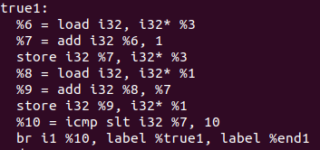

# lab3 实验报告
学号 PB18111699 姓名 魏钊

## 问题1: cpp与.ll的对应
请描述你的cpp代码片段和.ll的每个BasicBlock的对应关系。描述中请附上两者代码。

## assign_generator.cpp

main函数对应main BasicBlock

## fun_generator.cpp

callee函数对应callee BasicBlock

main函数对应main BasicBlock

## if_generator.cpp

main函数对应main BasicBlock

ture片段对应ture1 BasicBlock

false片段对应false1 BasicBlock

ret1片段对应4 BasicBlock

## while_generator.cpp

main函数对应main BasicBlock

ture1片段对应ture1 BasicBlock

end片段对应end1 BasicBlock

## 问题2: Visitor Pattern

exprRoot->numberF->exprE->exprD->numberB->numberA->exprC->numberA->numberB

## 问题3: getelementptr
请给出`IR.md`中提到的两种getelementptr用法的区别,并稍加解释:
  - `%2 = getelementptr [10 x i32], [10 x i32]* %1, i32 0, i32 0` 
  - `%2 = getelementptr i32, i32* %1 i32 0` 
  
两者区别主要在参数不同。

第一种用法往往用于已知的结构体指针或数组首地址指针。这里用于大小为10的int型数组，后面有两个参数0，第一个0是数组计算符，并不会改变返回的类型，因为，我们任何一个指针都可以作为一个数组来使用，进行对应的指针计算，所以这个0并不会省略。第二个0是结构体的计算地址，表示的是结构体的第0个元素的地址，这时，会根据结构体指针的类型，选取其中的元素长度，进行计算，最后返回的则是结构体成员的指针。

第二种用法单纯用于一般int型的地址计算。
## 实验难点
难度适中。大部分实验可以通过模仿样例代码完成。

## 实验反馈
无。
