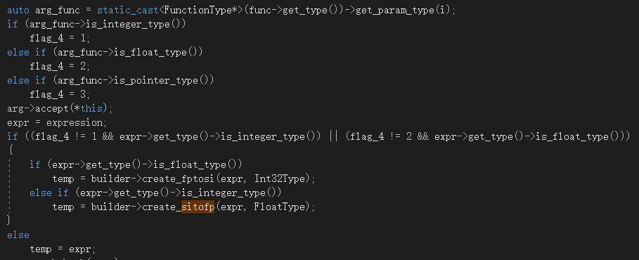
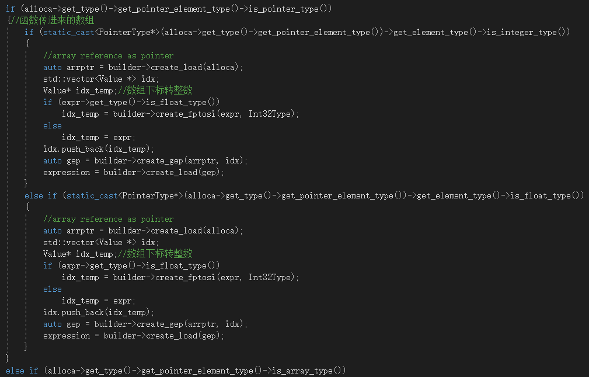
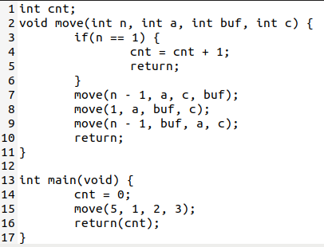

# Lab4 实验报告

小组成员 

姓名    学号

魏钊    PB18111699（队长）

孙宇鹏  PB18111695

杨嘉诚  PB18030996

## 实验要求

根据cminus-f语义，修改src/cminusfc/cminusf_builder.cpp，在助教提供的框架上正确实现一个cminus-f语言的IR生成器，将助教提供的抽象语法树翻译到正确的LLVM IR。

## 实验难点

全局传递表达式的值

存在的强制类型转换

存在多个返回语句和if或while中出现返回语句的处理

var中处理传递参数

得到函数形参的类型

## 实验设计
1. 如何设计全局变量

    BasicBlock* curr_block;

    用于记住当前正在插入代码的BasicBlock，有时需要创建新的BasicBlock，但又要在创建后返回原来的BasicBlock插入一些代码，就需要程序记住当前的BasicBlock；
    
    Value* return_alloca;

    用于存储返回值，遇到return时能够把返回值存放到正确的地方；
    
    Function* curr_func;

    用于记录当前BasicBlock所在函数；
    
    Value* expression;

    用于各种值的全局传递，因为expression的解析和使用在抽像语法树的不同部分，需要一个全局变量进行传递。
    
    bool is_returned,is_returned_record;

    标注是否已出现返回语句，用于忽略返回语句后的语句。为了在出现嵌套compound_stmt等情况下让if或while得知其中是否有return，并且避免因为记录了return而影响后续compound_stmt的分析，这里使用了两个全局变量，is_returned主要用于compound_stmt正常分析流程的控制，而is_returned_record为一个记录，保存了特定时刻is_returned的值，供if和while使用；
    
    int label_cnt;

    用于标签号管理，让生成的IR更易于阅读;
    
    var_op curr_op;

    用于确定当前对var作存储还是取值；
    
    int flag,flag_2;
    
    flag用于记录函数返回值类型，flag_2用于记录实际返回表达式的类型，当两者类型不同时，进行强制类型转换。flag=0时为void型，flag=1时为int型，flag=2时为float型。
2. 遇到的难点以及解决方案
    
    **全局传递表达式的值**
    
    因为在遍历抽像语法树时，不同节点之间无法进行直接的值传递，如果需要父节点获得子节点的值（或者相反），就需要通过一个全局变量在子节点完成分析后将得到的值存储，调用分析子节点的方法后，父节点可以在这个全局变量中得到子节点的值。比如，在additive_expression中的a+b，需要先对a和b分析，结束后才能建立那条完成加法的create_add，于是a和b的结果就需要先进行存储，而后在父节点中通过expression全局变量获得。其他信息，比如当前在进行指令插入的BasicBlock和Function，当前的返回值，都是用于完成类似功能的。
    
    **存在的强制类型转换**
    
    强制类型转换用到两个函数：builder->create_sitofp()和builder->create_fptosi();
    
    函数返回值的强制类型转换：
    
    
    
    在Var中的STORE部分，赋值时：
    
    数组：
    
    
    
    一般变量：
    
    
    
    二元运算的两个参数类型不一致时：
    
    简单表达式中（进行比较时）、加减时、乘除时：
    
    
    
    调用函数时，实参与形参的类型不一致：
    
    
    
    数组下标转整型：
    
    
    
    **存在多个返回语句和if或while中出现返回语句的处理**
    
    如果不进行特殊处理，在连续出现return语句，或者if、while中最后一条是return语句，生产的IR中会出现连续的ret，或者ret后紧跟br指令。开始我们认为这种格式没有问题，在运行出错后才发现原来LLVM IR会将ret，br等指令认为是BasicBlock的结束，从而开始一个新的（未显式标号）的BasicBlock，这将导致后面的代码和变量编号错误。于是必须单独处理嵌套代码中的return语句。我们的方法是使用两个全局变量（is_returned, is_returned_record）记录在if，else，while等内部有没有return语句，如果有，就不予添加正常在if等结束后该有的跳转br指令。同时在一个compound_stmt内部，如果发现了return_stmt，就不予分析后面可能还有的代码。于是这两处处理解决了return的问题。
    
    
    
    还有，比如在if中，条件跳转指令在if的最前面，而该跳转指令的两个目标BasicBlock还没有生成， 就必须等待两个BasicBlock生成完成后，再回头补上这个CondBr。同样，在if和else结束后要补充一条到整个if结构后面的无条件跳转，而这条跳转也必须在if结构生成结束后补充添加。这种非线性的顺序给程序带来了一定的困难。引入全局变量curr_block的主要目的就是解决这个问题：在if体分析结束后还能够获得最后一个BasicBlock，也就是br该被插入的地方。
    
    **var中处理传递参数**
    
    这里特别使用了强制类型转换的方法（因为从符号表中读出的是父类型Value，Value并没有我们所需要的方法），以下面代码为例，通过转换，取出参数中数组的类型，进而进行相关处理：
    
    `static_cast<PointerType*>(alloca->get_type()->get_pointer_element_type())->get_element_type()->is_integer_type()`
    
    
   
    **得到函数形参的类型**
    
    在主函数中调用函数时，传递参数，我们需要知道形参的类型进而进行可能的强制类型转换，需要先用scope取到函数，但取到的是Value型，无法直接使用，先利用上面提到的强制类型转换，然后利用get_param_type()。
    
   `auto func = scope.find(node.id);
    
    auto arg_func = static_cast<FunctionType*>(func->get_type())->get_param_type(i);`

3. 如何降低生成 IR 中的冗余

    在ReturnStmt中，将所有可能的return放入returnblock中，统一处理，避免每次单独处理，产生大量冗余代码。

4. 样例分析

    在通过12个基础样例的基础上，设计了一些较难的样例。
    
    
    
    
    
    
    
    
    
    
    
    
    
    
    
    
    

### 实验总结

**收获：**
    通过这次的实验，我们加深了对编译原理所学知识的认识，更加深刻地理解了文法、语法、语义等。同时我们也获得了编写较大项目的经验，以及团队合作编写代码的经验。

**教训：**

（1）阅读文档需要更加系统、仔细。我们在实验中遇到了一些难以解决的问题，或是使用了一些较为麻烦地解决方法，但最后发现更好地解决方法就在助教给的头文件中，而我们没有仔细阅读。

（2）在合作编写代码及debug时，每位队员做完一部分内容后会上传自己更改后的代码，由于不同版本过多，又没有标志性的文件名，导致后期整合代码时遇到了较大的困难。我们应该提前安排好任务，在上传代码时加上详细的说明，解释自己在哪里做了改动。

