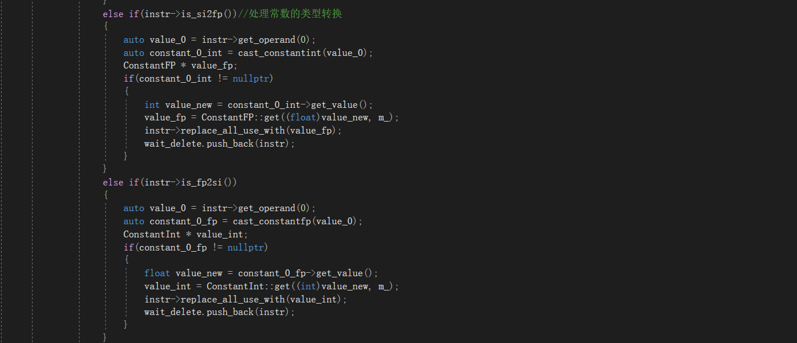

# Lab5 实验报告

小组成员 姓名 学号

魏钊    PB18111699（队长）

孙宇鹏  PB18111695

杨嘉诚  PB18030996

## 实验要求

1、阅读`Mem2Reg`与`LoopSearch`两个优化Pass的代码，掌握如何开发基于LightIR的优化Pass。

2、开发三个基本pass：

**常量传播**

	实现在编译优化阶段，能够计算出结果的变量，就直接替换为常量。

**循环不变式外提**

	实现将与循环无关的表达式提取到循环的外面。

**活跃变量分析**

    能够实现分析bb块的入口和出口的活跃变量。

## 实验难点

1、如何正确删除指令，保证删除相应指令后不会使其他指令的运行受到影响。

2、在做常量传播时，若数据类型不匹配需要进行强制类型转换时的处理。

3、如何正确地找到循环不变式（只要某个式子的操作数在这个循环内被赋值就不是循环不变式）。

4、如何将删除的循环不变式添加到正确的位置以保证执行结果正确。

5、在查找活跃变量的过程中，循环何时停止。

6、如何处理PHI指令导致的后继的live_in不一定都是前驱的live_out。


## 实验设计

* 常量传播

    实现思路：
    
    1、对操作数为常量的表达式（四则运算及比较），计算出结果，将其他地方用的该结果的地方用计算出的常量代替，并删除该指令。
    
    对整型常数计算
    
    
    
    对整型常数比较
    
    
    
    compare函数类似compute，返回常量比较的结果（整型）。（其余函数为助教给出，其实现不再演示）
    
    
    
    
    
    2、因为在处理常数计算时，可能会遇到不同类型的常数进行比较或计算，则需要在运算之前做强制类型转换。所以对操作数为常数的强制类型转换（si2fp、fp2si、zext等）也进行折叠、传播操作。用ConstantFP::get将常数转换成对应类型，用常数取代原输出在其他代码中的位置，并删除该条指令。
    
    
    
    
    
    3、如果有if(constant)的情况，需要先行判断constant是否大于constantzero，将条件跳转改为无条件跳转，并删去无用的死代码（若为真，则else中的指令永远不会执行）。并且对于出现if判断时，要对if—else和只有if的情况分开处理，当出现if-else时，将对应的true（flase）块删除后，将flase（true）块和end块一起合并；当只有if时，若则要删除true（或不删除）块，并将其和end块一起合并。
    
   
    
    
    
    4、若if和else指令进行过优化，则phi指令也会出现冗余，有的块已被删除则不可能达到或者有的块是必然经过的，则phi的值也无需进行选择，可以直接得到，进一步优化IR代码。
    
    
    
    
    
    优化前后的IR对比（举一个例子）并辅以简单说明：
    
    以助教给出的testcase3进行测试说明：
    
    ```
    <testcase-3.cminus>
    
    void main(void){
        int c;
        int a;
        int b;
        int d;
        int f;
        int g;
    
        c=0;
        a=0;
        while(c<100000000)
        {
            a=1.23456*5.73478*2.3333*4.3673*6.34636;
            b=a*a*a*a*a*a;
            d=b*b*b*b*b*b;
            f=d*d*d*d*d*d;
            g=f*f*f*f*f*f;
            c=c+1;
        }
        output(g);
        return ;
    }
    ```
    
    优化前：可以看到执行了大量的常数四则运算，IR文件冗余过多。
    
    ```
    ; ModuleID = 'cminus'
    source_filename = "test.cminus"
    
    declare i32 @input()
    
    declare void @output(i32)
    
    declare void @outputFloat(float)
    
    declare void @neg_idx_except()
    
    define void @main() {
    label_entry:
      br label %label6
    label6:                                                ; preds = %label_entry, %label11
      %op65 = phi i32 [ %op60, %label11 ], [ undef, %label_entry ]
      %op66 = phi i32 [ %op49, %label11 ], [ undef, %label_entry ]
      %op67 = phi i32 [ %op38, %label11 ], [ undef, %label_entry ]
      %op68 = phi i32 [ %op27, %label11 ], [ undef, %label_entry ]
      %op69 = phi i32 [ 0, %label_entry ], [ %op62, %label11 ]
      %op70 = phi i32 [ 0, %label_entry ], [ %op16, %label11 ]
      %op8 = icmp slt i32 %op69, 100000000
      %op9 = zext i1 %op8 to i32
      %op10 = icmp ne i32 %op9, 0
      br i1 %op10, label %label11, label %label63
    label11:                                                ; preds = %label6
      %op12 = fmul float 0x3ff3c0c200000000, 0x4016f06a20000000
      %op13 = fmul float %op12, 0x4002aa9940000000
      %op14 = fmul float %op13, 0x4011781d80000000
      %op15 = fmul float %op14, 0x401962ac40000000
      %op16 = fptosi float %op15 to i32
      %op19 = mul i32 %op16, %op16
      %op21 = mul i32 %op19, %op16
      %op23 = mul i32 %op21, %op16
      %op25 = mul i32 %op23, %op16
      %op27 = mul i32 %op25, %op16
      %op30 = mul i32 %op27, %op27
      %op32 = mul i32 %op30, %op27
      %op34 = mul i32 %op32, %op27
      %op36 = mul i32 %op34, %op27
      %op38 = mul i32 %op36, %op27
      %op41 = mul i32 %op38, %op38
      %op43 = mul i32 %op41, %op38
      %op45 = mul i32 %op43, %op38
      %op47 = mul i32 %op45, %op38
      %op49 = mul i32 %op47, %op38
      %op52 = mul i32 %op49, %op49
      %op54 = mul i32 %op52, %op49
      %op56 = mul i32 %op54, %op49
      %op58 = mul i32 %op56, %op49
      %op60 = mul i32 %op58, %op49
      %op62 = add i32 %op69, 1
      br label %label6
    label63:                                                ; preds = %label6
      call void @output(i32 %op65)
      ret void
    }
    ```
    
    优化后：循环内只剩下了一个计算指令（c = c + 1)，极大消除了冗余，加快了IR文件执行速度。
    
    ```
    ; ModuleID = 'cminus'
    source_filename = "test.cminus"
    
    declare i32 @input()
    
    declare void @output(i32)
    
    declare void @outputFloat(float)
    
    declare void @neg_idx_except()
    
    define void @main() {
    label_entry:
      br label %label6
    label6:                                                ; preds = %label_entry, %label11
      %op65 = phi i32 [ 711082625, %label11 ], [ undef, %label_entry ]
      %op66 = phi i32 [ -599454271, %label11 ], [ undef, %label_entry ]
      %op67 = phi i32 [ 632274337, %label11 ], [ undef, %label_entry ]
      %op68 = phi i32 [ -1115555215, %label11 ], [ undef, %label_entry ]
      %op69 = phi i32 [ 0, %label_entry ], [ %op62, %label11 ]
      %op70 = phi i32 [ 0, %label_entry ], [ 457, %label11 ]
      %op8 = icmp slt i32 %op69, 100000000
      %op9 = zext i1 %op8 to i32
      %op10 = icmp ne i32 %op9, 0
      br i1 %op10, label %label11, label %label63
    label11:                                                ; preds = %label6
      %op62 = add i32 %op69, 1
      br label %label6
    label63:                                                ; preds = %label6
      call void @output(i32 %op65)
      ret void
    }
    ```
    
    
    
    脚本测试结果：
    
    
    
    


* 循环不变式外提
    实现思路：
    
    1、通过loopsearch来找到函数内所有的循环，通过 get_inner_loop()函数先找到最内层循环，并通过get_loop_base()函数找到循环的入口，然后从内而外处理循环中出现的循环不变量，确保不遗漏（有些不变量外提后仍是不变量）。
    
    
    
    
    
    2、循环不变量的判定条件： 某个变量如果其表达式的所有操作数都是常量，或者是循环内部已经被标定为*循环不变量*的变量，或者是循环外部的变量，那么这条表达式被称为*循环不变量*。前两点较易解决，第三点的解决借助了phi指令的参数。只要变量在循环中被赋值，就会成为phi指令的参数，若此变量被发现是循环不变量，则从此栈中删除。先将phi所有的参数入栈，在扫描指令时，判断其操作数：是否为常数、是否已被标定为循环不变量、是否在phi指令栈中，以此决定其是否为循环不变量。然后迭代已经判断为是循环不变量和不是循环不变量的表达式，并将确定的循环不变量保存起来，并将原位置的指令保存并删除。这样可以实现全部命令的判断。
    
    
    
    
    
    3、最后将保存起来的循环不变量添加到其原本所在循环前驱块的开头处。由于数据用栈保存，所以在添加时要注意出栈与添加的顺序，避免代码顺序出错。
    
    
    
    
    
    优化前后的IR对比（举一个例子）并辅以简单说明：
    
    以助教给出的testcase3进行测试说明：
    
    ```
    <testcase-3.cminus>
    
    void main(void){
        int i;
        int j;
        int k;
        int o;
        int p;
        int q;
        int a;
        int ret;
    
        a = 2;
    
        i = 0;
        while(i<1000000)
        {
            j = 0;
            while(j<2)
            {
                k = 0;
                while(k<2)
                {
                    o = 0;
                    while(o<2)
                    {
                        p = 0;
                        while(p<2)
                        {
                            q = 0;
                            while(q<2)
                            {
                                ret = (a*a*a*a*a*a*a*a*a*a)/a/a/a/a/a/a/a/a/a/a;
                                q=q+1;
                            }
                            p=p+1;
                        }
                        o=o+1;
                    }
                    k=k+1;
                }
                j=j+1;
            }
            i=i+1;
        }
    	output(ret);
        return ;
    }
    ```
    
    优化前：可以发现大量与循环无关的计算指令被放在了最内层循环，使得计算次数巨大，运行效率较低。
    
    ```
    ; ModuleID = 'cminus'
    source_filename = "test.cminus"
    
    declare i32 @input()
    
    declare void @output(i32)
    
    declare void @outputFloat(float)
    
    declare void @neg_idx_except()
    
    define void @main() {
    label_entry:
      br label %label8
    label8:                                                ; preds = %label_entry, %label22
      %op102 = phi i32 [ %op109, %label22 ], [ undef, %label_entry ]
      %op103 = phi i32 [ %op110, %label22 ], [ undef, %label_entry ]
      %op104 = phi i32 [ %op111, %label22 ], [ undef, %label_entry ]
      %op105 = phi i32 [ %op112, %label22 ], [ undef, %label_entry ]
      %op106 = phi i32 [ %op113, %label22 ], [ undef, %label_entry ]
      %op107 = phi i32 [ 0, %label_entry ], [ %op24, %label22 ]
      %op108 = phi i32 [ %op114, %label22 ], [ undef, %label_entry ]
      %op10 = icmp slt i32 %op107, 1000000
      %op11 = zext i1 %op10 to i32
      %op12 = icmp ne i32 %op11, 0
      br i1 %op12, label %label13, label %label14
    label13:                                                ; preds = %label8
      br label %label16
    label14:                                                ; preds = %label8
      call void @output(i32 %op102)
      ret void
    label16:                                                ; preds = %label13, %label31
      %op109 = phi i32 [ %op102, %label13 ], [ %op115, %label31 ]
      %op110 = phi i32 [ %op103, %label13 ], [ %op116, %label31 ]
      %op111 = phi i32 [ %op104, %label13 ], [ %op117, %label31 ]
      %op112 = phi i32 [ %op105, %label13 ], [ %op118, %label31 ]
      %op113 = phi i32 [ %op106, %label13 ], [ %op119, %label31 ]
      %op114 = phi i32 [ 0, %label13 ], [ %op33, %label31 ]
      %op18 = icmp slt i32 %op114, 2
      %op19 = zext i1 %op18 to i32
      %op20 = icmp ne i32 %op19, 0
      br i1 %op20, label %label21, label %label22
    label21:                                                ; preds = %label16
      br label %label25
    label22:                                                ; preds = %label16
      %op24 = add i32 %op107, 1
      br label %label8
    label25:                                                ; preds = %label21, %label40
      %op115 = phi i32 [ %op109, %label21 ], [ %op120, %label40 ]
      %op116 = phi i32 [ %op110, %label21 ], [ %op121, %label40 ]
      %op117 = phi i32 [ %op111, %label21 ], [ %op122, %label40 ]
      %op118 = phi i32 [ %op112, %label21 ], [ %op123, %label40 ]
      %op119 = phi i32 [ 0, %label21 ], [ %op42, %label40 ]
      %op27 = icmp slt i32 %op119, 2
      %op28 = zext i1 %op27 to i32
      %op29 = icmp ne i32 %op28, 0
      br i1 %op29, label %label30, label %label31
    label30:                                                ; preds = %label25
      br label %label34
    label31:                                                ; preds = %label25
      %op33 = add i32 %op114, 1
      br label %label16
    label34:                                                ; preds = %label30, %label49
      %op120 = phi i32 [ %op115, %label30 ], [ %op124, %label49 ]
      %op121 = phi i32 [ %op116, %label30 ], [ %op125, %label49 ]
      %op122 = phi i32 [ %op117, %label30 ], [ %op126, %label49 ]
      %op123 = phi i32 [ 0, %label30 ], [ %op51, %label49 ]
      %op36 = icmp slt i32 %op123, 2
      %op37 = zext i1 %op36 to i32
      %op38 = icmp ne i32 %op37, 0
      br i1 %op38, label %label39, label %label40
    label39:                                                ; preds = %label34
      br label %label43
    label40:                                                ; preds = %label34
      %op42 = add i32 %op119, 1
      br label %label25
    label43:                                                ; preds = %label39, %label99
      %op124 = phi i32 [ %op120, %label39 ], [ %op127, %label99 ]
      %op125 = phi i32 [ %op121, %label39 ], [ %op128, %label99 ]
      %op126 = phi i32 [ 0, %label39 ], [ %op101, %label99 ]
      %op45 = icmp slt i32 %op126, 2
      %op46 = zext i1 %op45 to i32
      %op47 = icmp ne i32 %op46, 0
      br i1 %op47, label %label48, label %label49
    label48:                                                ; preds = %label43
      br label %label52
    label49:                                                ; preds = %label43
      %op51 = add i32 %op123, 1
      br label %label34
    label52:                                                ; preds = %label48, %label57
      %op127 = phi i32 [ %op124, %label48 ], [ %op96, %label57 ]
      %op128 = phi i32 [ 0, %label48 ], [ %op98, %label57 ]
      %op54 = icmp slt i32 %op128, 2
      %op55 = zext i1 %op54 to i32
      %op56 = icmp ne i32 %op55, 0
      br i1 %op56, label %label57, label %label99
    label57:                                                ; preds = %label52
      %op60 = mul i32 2, 2
      %op62 = mul i32 %op60, 2
      %op64 = mul i32 %op62, 2
      %op66 = mul i32 %op64, 2
      %op68 = mul i32 %op66, 2
      %op70 = mul i32 %op68, 2
      %op72 = mul i32 %op70, 2
      %op74 = mul i32 %op72, 2
      %op76 = mul i32 %op74, 2
      %op78 = sdiv i32 %op76, 2
      %op80 = sdiv i32 %op78, 2
      %op82 = sdiv i32 %op80, 2
      %op84 = sdiv i32 %op82, 2
      %op86 = sdiv i32 %op84, 2
      %op88 = sdiv i32 %op86, 2
      %op90 = sdiv i32 %op88, 2
      %op92 = sdiv i32 %op90, 2
      %op94 = sdiv i32 %op92, 2
      %op96 = sdiv i32 %op94, 2
      %op98 = add i32 %op128, 1
      br label %label52
    label99:                                                ; preds = %label52
      %op101 = add i32 %op126, 1
      br label %label43
    }
    ```
    
    优化后：与循环无关的计算指令均被拿到了循环之外（最外层），大大加快了运行效率。
    
    ```
    ; ModuleID = 'cminus'
    source_filename = "test.cminus"
    
    declare i32 @input()
    
    declare void @output(i32)
    
    declare void @outputFloat(float)
    
    declare void @neg_idx_except()
    
    define void @main() {
    label_entry:
      %op60 = mul i32 2, 2
      %op62 = mul i32 %op60, 2
      %op64 = mul i32 %op62, 2
      %op66 = mul i32 %op64, 2
      %op68 = mul i32 %op66, 2
      %op70 = mul i32 %op68, 2
      %op72 = mul i32 %op70, 2
      %op74 = mul i32 %op72, 2
      %op76 = mul i32 %op74, 2
      %op78 = sdiv i32 %op76, 2
      %op80 = sdiv i32 %op78, 2
      %op82 = sdiv i32 %op80, 2
      %op84 = sdiv i32 %op82, 2
      %op86 = sdiv i32 %op84, 2
      %op88 = sdiv i32 %op86, 2
      %op90 = sdiv i32 %op88, 2
      %op92 = sdiv i32 %op90, 2
      %op94 = sdiv i32 %op92, 2
      %op96 = sdiv i32 %op94, 2
      br label %label8
    label8:                                                ; preds = %label_entry, %label22
      %op102 = phi i32 [ %op109, %label22 ], [ undef, %label_entry ]
      %op103 = phi i32 [ %op110, %label22 ], [ undef, %label_entry ]
      %op104 = phi i32 [ %op111, %label22 ], [ undef, %label_entry ]
      %op105 = phi i32 [ %op112, %label22 ], [ undef, %label_entry ]
      %op106 = phi i32 [ %op113, %label22 ], [ undef, %label_entry ]
      %op107 = phi i32 [ 0, %label_entry ], [ %op24, %label22 ]
      %op108 = phi i32 [ %op114, %label22 ], [ undef, %label_entry ]
      %op10 = icmp slt i32 %op107, 1000000
      %op11 = zext i1 %op10 to i32
      %op12 = icmp ne i32 %op11, 0
      br i1 %op12, label %label13, label %label14
    label13:                                                ; preds = %label8
      br label %label16
    label14:                                                ; preds = %label8
      call void @output(i32 %op102)
      ret void
    label16:                                                ; preds = %label13, %label31
      %op109 = phi i32 [ %op102, %label13 ], [ %op115, %label31 ]
      %op110 = phi i32 [ %op103, %label13 ], [ %op116, %label31 ]
      %op111 = phi i32 [ %op104, %label13 ], [ %op117, %label31 ]
      %op112 = phi i32 [ %op105, %label13 ], [ %op118, %label31 ]
      %op113 = phi i32 [ %op106, %label13 ], [ %op119, %label31 ]
      %op114 = phi i32 [ 0, %label13 ], [ %op33, %label31 ]
      %op18 = icmp slt i32 %op114, 2
      %op19 = zext i1 %op18 to i32
      %op20 = icmp ne i32 %op19, 0
      br i1 %op20, label %label21, label %label22
    label21:                                                ; preds = %label16
      br label %label25
    label22:                                                ; preds = %label16
      %op24 = add i32 %op107, 1
      br label %label8
    label25:                                                ; preds = %label21, %label40
      %op115 = phi i32 [ %op109, %label21 ], [ %op120, %label40 ]
      %op116 = phi i32 [ %op110, %label21 ], [ %op121, %label40 ]
      %op117 = phi i32 [ %op111, %label21 ], [ %op122, %label40 ]
      %op118 = phi i32 [ %op112, %label21 ], [ %op123, %label40 ]
      %op119 = phi i32 [ 0, %label21 ], [ %op42, %label40 ]
      %op27 = icmp slt i32 %op119, 2
      %op28 = zext i1 %op27 to i32
      %op29 = icmp ne i32 %op28, 0
      br i1 %op29, label %label30, label %label31
    label30:                                                ; preds = %label25
      br label %label34
    label31:                                                ; preds = %label25
      %op33 = add i32 %op114, 1
      br label %label16
    label34:                                                ; preds = %label30, %label49
      %op120 = phi i32 [ %op115, %label30 ], [ %op124, %label49 ]
      %op121 = phi i32 [ %op116, %label30 ], [ %op125, %label49 ]
      %op122 = phi i32 [ %op117, %label30 ], [ %op126, %label49 ]
      %op123 = phi i32 [ 0, %label30 ], [ %op51, %label49 ]
      %op36 = icmp slt i32 %op123, 2
      %op37 = zext i1 %op36 to i32
      %op38 = icmp ne i32 %op37, 0
      br i1 %op38, label %label39, label %label40
    label39:                                                ; preds = %label34
      br label %label43
    label40:                                                ; preds = %label34
      %op42 = add i32 %op119, 1
      br label %label25
    label43:                                                ; preds = %label39, %label99
      %op124 = phi i32 [ %op120, %label39 ], [ %op127, %label99 ]
      %op125 = phi i32 [ %op121, %label39 ], [ %op128, %label99 ]
      %op126 = phi i32 [ 0, %label39 ], [ %op101, %label99 ]
      %op45 = icmp slt i32 %op126, 2
      %op46 = zext i1 %op45 to i32
      %op47 = icmp ne i32 %op46, 0
      br i1 %op47, label %label48, label %label49
    label48:                                                ; preds = %label43
      br label %label52
    label49:                                                ; preds = %label43
      %op51 = add i32 %op123, 1
      br label %label34
    label52:                                                ; preds = %label48, %label57
      %op127 = phi i32 [ %op124, %label48 ], [ %op96, %label57 ]
      %op128 = phi i32 [ 0, %label48 ], [ %op98, %label57 ]
      %op54 = icmp slt i32 %op128, 2
      %op55 = zext i1 %op54 to i32
      %op56 = icmp ne i32 %op55, 0
      br i1 %op56, label %label57, label %label99
    label57:                                                ; preds = %label52
      %op98 = add i32 %op128, 1
      br label %label52
    label99:                                                ; preds = %label52
      %op101 = add i32 %op126, 1
      br label %label43
    }
    ```


脚本测试结果：


* 活跃变量分析
    实现思路：
    
    根据下图算法，首先应该得到每个基本块的Use和Def。
    
    
    
    但在实际循环过程中，遍历基本块的顺序是逆序深度优先遍历（即从深度最深的基本块开始）
    
    进行初始化
    
    
    
    调用函数PostOrder得到遍历顺序，并存入BBlist.
    
    
    
    
    
    PostOrder的实现：
    
    
    
    使用map记录Use和Def,同时用BB_phi记录每个基本块的PHI指令。
    
    
    
    
    
    使用函数Get_used_v()得到Use和Def,同时记录每个BB的PHI指令为后续特殊处理做准备。
    
    
    
    

    在Get_used_v()中调用I_Get_used_v()对每条指令进行处理。
    
    关于Use和Def的定义如下：
    
    
    
    以此为依据找到每个BB的Use和Def变量。
    
    
    
    预处理全部结束，开始循环查找每个BB块的Live_in和Live_out.
    
    使用pre_live_in和pre_live_out记录前一次循环的活跃变量，当所有BB块的live_in与前一次相比不再有变化时，循环结束，即已找到稳定的活跃变量。
    
    
    
    计算每个BB的live_in和live_out，特别注意PHI指令的处理，PHI指令引入的两个变量在当前块都算是live_in，但是当前块的前驱块中live_out必须删除不是当前块产生的变量，这时就用到了BB_phi.
    
    对当前块的后继块的每条PHI指令都进行如下操作，删除当前块live_out中不属于自己变量。
    
    
    
    完整活跃变量计算过程：
    
    live_out计算过程：
    
    
        
    live_in计算过程：
        
    
    
    对每个BB块在这次循环产生的活跃变量与上一次比较，并进行pre_live_in/out的更新为下一次比较做准备，只要有一个块不同，即不稳定，flag=true,循环继续。
    
    
    

​	   脚本测试结果：


### 实验总结

1、掌握了基于LightIR的优化Pass的开发方式，加深了对LLVMIR的理解。

2、复习并实践了课内所学的代码优化知识，对代码优化有了更深一层的认识。

### 实验反馈 （可选 不会评分）

无。

### 组间交流 （可选）

无。
